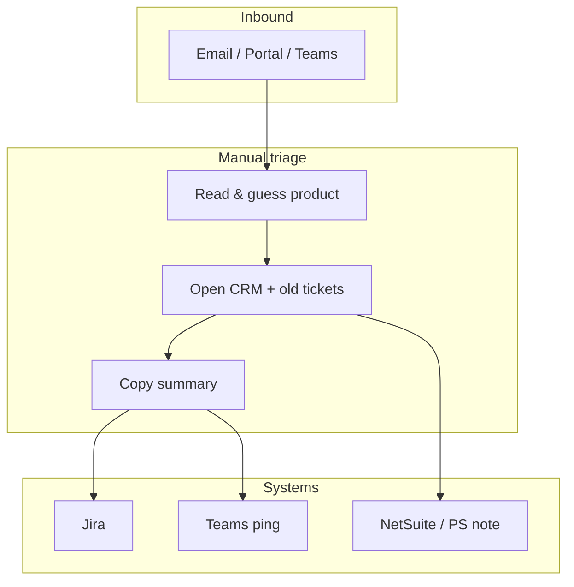
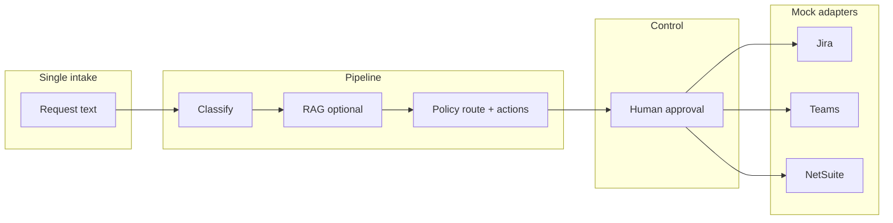

# Workflow discovery & friction map (reference)

This content was previously a separate Streamlit page; it is kept here for interview talking points. The live demo uses **three pages**: Case intake, Case run, Policy & privacy.

## As-is (illustrative — multi-product SaaS support / ops)

- **Friction:** High — many tools, manual routing.
- **Copy-paste:** Frequent — same context re-keyed in Jira/CRM.
- **Handoffs:** 3–6 steps — Email → Teams → spreadsheet → ticket.

### Steps

1. **Inbound** — Email, portal, or Teams message with unstructured text.
2. **Triage** — Agent reads thread, guesses product (TrialMaster vs IRMS MAX vs TA Scan).
3. **Context** — Open CRM, old tickets, maybe NetSuite for project/billing.
4. **Copy-paste** — Summary pasted into Jira; channel ping in Teams.
5. **Wait** — Wrong queue or missing context → **rework** and SLA risk.

### Pain tags (what to automate first)

- **Repetition** — Same triage checklist every time.
- **Copy-paste** — Request text manually split across Jira + CRM + Teams.
- **Latency** — Time-to-first-action while humans coordinate.
- **Audit gap** — Decisions live in chat/email unless someone logs them.

## To-be (this demo)

1. **Single intake** — One structured submission (or pasted email body).
2. **Classify + optional RAG** — Product/issue/urgency with **internal** KB grounding when useful.
3. **Route** — Team, queue, SLA with **reasoning** in the audit trail (deterministic policy).
4. **Propose actions** — Selective integrations (mocked adapters).
5. **Human approval** — Nothing “writes” until approved.
6. **Execute** — Adapter pattern (AnjuBUS-style) with logged results.

## Diagrams (Mermaid)

### As-is (fragmented handoffs)

### To-be (single pipeline + approval)

In interviews, tie this to *their* systems: Jira for work, Teams for alerts, NetSuite for services/finance touchpoints.
